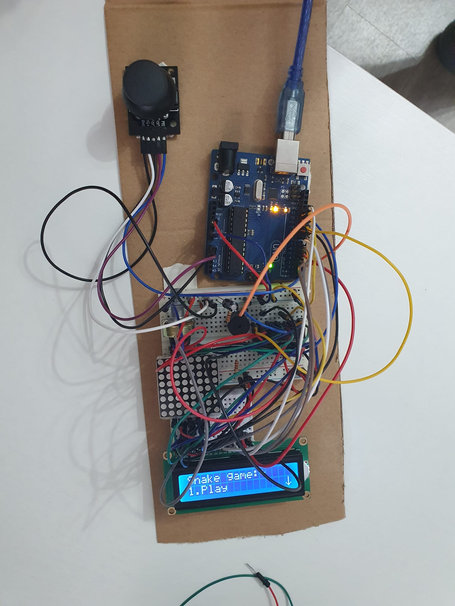

# Snake-game-Arduino
Arduino game - Introduction to robotics

### Backstory
Snake was the game that I always played in my childhood, so it wasn't such a hard decision to choose this game. I thought it would be very interesting to recreate a game that everyone played in their childhood. To make it funnier, as the difficulty increases, the speed of the snake increases and new walls appear in his path.

### Game description
It's just like the game from childhood. You control the snake with the joystick and yout goal is to eat as much food as possible. If the snake left the matrix, touches its own tail or the walls, it died.
 
The game has 3 levels of difficulty:
  - **Difficulty 1**: The classic game, without anything added.
  - **Difficulty 2**: The speed of the snake increases and 12 walls appear that must be avoided.
  - **Difficulty 3**: The speed of the snake increases even more. In addition, there are 8 more walls compared to the 2nd difficulty.
  
  
 
 ### How to play
 -> Make your own settings: sound, matrix brightness, lcd brightness, lcd contrast
 -> Chose the difficulty you want
 -> Eat as much food as you can
 
  
 
 ### Used components
 - Matrix(8x8)
 - LCD display 
 - Joystick
 - Potentiometer
 - Buzzer
 - Wires and resistors
 
  
 
 ### Image
 
 
  
 
 ### Video
 
